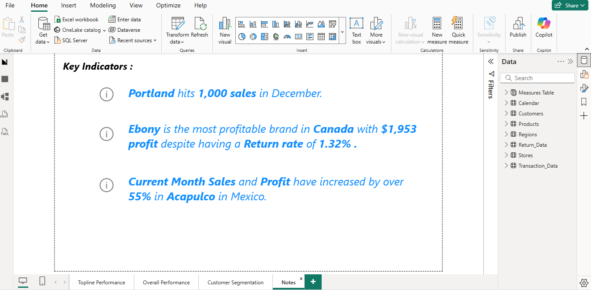

# Maven Market Retail Performance Analytics Dashboard

## Overview

Maven Market Retail Performance Analytics Dashboard is an end-to-end Business Intelligence solution developed in Power BI to analyze retail sales performance, profitability, customer behavior, and regional trends across North America. The dashboard transforms raw transactional data into actionable insights through interactive visualizations, KPI tracking, and DAX-driven analytics.

## Objectives

- Monitor revenue, profit, transactions, and returns.
- Evaluate product and brand performance.
- Analyze customer purchasing behavior and segmentation.
- Track business performance against predefined targets.
- Identify regional growth opportunities.
- Generate actionable insights through data-driven reporting.

## Tools & Technologies

- Power BI
- DAX (Data Analysis Expressions)
- Power Query
- Data Modeling
- Data Visualization

## Dashboard Pages

### 1. Topline Performance

Provides an executive overview of business performance through key KPIs and operational metrics.

Features:

- Current Month Transactions
- Current Month Profit
- Current Month Returns
- Weekly Revenue Trending
- Revenue vs Target Analysis
- Product Brand Performance
- Geographic Sales Analysis

### 2. Overall Performance

Analyzes company-wide sales and profitability trends.

Features:

- Revenue Trend Analysis
- Revenue by Gender
- Revenue by Occupation
- Transactions by Brand
- Revenue by Country and Region
- Last 60-Day Profit Tracking
- Annual Event Revenue Impact Analysis

### 3. Customer Segmentation

Focuses on customer analytics and revenue contribution.

Features:

- Total Customer Growth
- Revenue Per Customer Analysis
- Top 100 Customers
- Top Customer Identification
- Customer Revenue Trends
- Transaction Analysis

### 4. Business Insights

Highlights automatically generated business findings and recommendations.

Sample Insights:

- Portland exceeded 1,000 sales in December.
- Ebony was the most profitable brand in Canada.
- Acapulco recorded over 55% growth in monthly sales and profit.

## Business Impact

The dashboard enables stakeholders to monitor retail performance, evaluate customer behavior, identify high-performing products and regions, and support data-driven business decisions through centralized reporting and interactive analytics.

